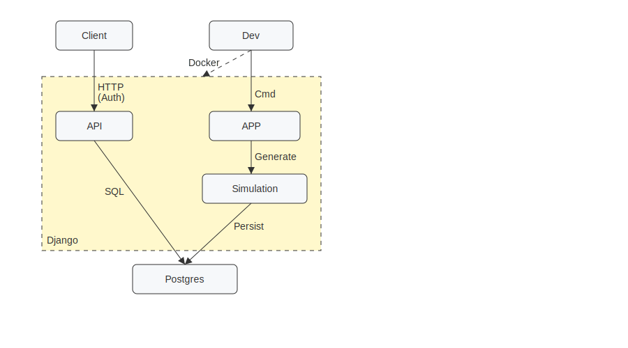

# Elephants Food Bot — Django + DRF 

A Dockerized Django service that simulates 100 “A asks → B answers top-3 foods” chats, stores results in SQL, and exposes an **authenticated** API that lists vegetarian/vegan users with their top-3 foods.

> Stack: <br>
> - Django <br>
> - DRF <br>
> - Postgres (local via Docker) <br>
> - structured logs <br>
> - tests + CI <br>


## Architecture


## Quickstart

Pre-requirements:
- Docker
- Docker Compose
- OpenAI API key

### 1. Environment
```
cp .env.example .env
```

- Edit `.env` and set:
```
OPENAI_API_KEY=sk-... # required for live simulation
EFB_LLM_CALL_BUDGET=20  # max number of OpenAI calls per run
```

### 2. Start services
`make up`

### 3. Apply migrations
`make migrate`

### 4. Create a superuser (for admin & quick Auth tests)
`make superuser`

### 5. Load simulation data
`make simulation`

- The command stores:
    - **Conversation A**: the prompt used (base + seed).
    - **Conversation B**: the returned list of 3 foods (as text), and token/cost.

### 6. Hit the API (Basic Auth)
`curl -s -i -u <username>:<password> GET http://localhost:8000/api/veg-users/`

### 7. Optionally, you can hit the API using Token Auth
`make token U=<username>`
  - Generate token

`curl -s -i -H "Authorization: Token <TOKEN>" http://localhost:8000/api/veg-users/`
  - API call using the generated token as authentication method


## API

### Authentication

- **Basic Auth**: username/password you created with `createsuperuser` (or any staff/user).
- **Token Auth**: supply `Authorization: Token <your-token>` header.
    - Obtain a token via `make token U=<username>`.


### Endpoints

GET `/api/veg-users/`
  - Returns users classified as **vegetarian** or **vegan**, with top-3 foods.
  - **Response (example)**
    ```json
    [
      {
        "user_id":"33beafb1-5d2c-40ff-8062-2073851bc8de",
        "run_id":"728d9378-29bd-46c1-9b1c-5fc9be6caa93",
        "diet":"vegan",
        "top3":["caprese salad","avocado toast","banana"]
      }
    ]
    ```

## Local services

- **App**: http://localhost:8000
- **Admin**: http://localhost:8000/admin/
- **Postgres**: localhost:5432 (inside Docker network at `db:5432`)
    - DB name: efb
    - DB user:efb_user
    - DB password: efb_pass


### Secrets

- Some credentials are hardcoded in `compose.yaml` for readability (`efb_user/efb_pass`). For production, move them to `.env` and reference with `${VAR}`.
- **OpenAI**: keep your `OPENAI_API_KEY` only in local `.env` and in GitHub **Actions → Secrets** (for CI).
- `EFB_LLM_CALL_BUDGET` caps OpenAI calls (for tests and CI smoke runs).


### Logging

- Logs are JSON via structlog:
`make logs`


### Teardown

- Stop/remove container (erasing volumes):
`make down`


### Tests & CI

- Run tests locally:
`make test`

- CI runs two stages:
  1) **Lint + unit tests** (no OpenAI calls, tests use fakes).
  2) **OpenAI smoke** (only if `OPENAI_API_KEY` secret is present): runs `simulate_foods --runs=3` with a small budget (default `EFB_LLM_CALL_BUDGET=12`).

To enable the smoke job, add `OPENAI_API_KEY` in **Settings → Secrets and variables → Actions**.


## Deploy

### 1. Makefile
Replace with your info:
```
DOCKERHUB_USER ?= <your-dockerhub-user>
IMAGE_NAME ?= elephants-food-bot
IMAGE_TAG ?= prod
```


### 2. Build docker image
`make docker-build-prod`


### 3. Push docker image to DockerHub
`make docker-push-prod`


### 4. Create the Web App
- Login
`az login`

- Create resource group
`az group create -n rg-efb -l westeurope`

- Create App Service plan
`az appservice plan create -g rg-efb -n asp-efb --sku F1 --is-linux`

- Create Web App for Containers and pull Docker Hub image
```
az webapp create -g rg-efb -p asp-efb -n <appname> \
  --deployment-container-image-name $DOCKERHUB_USER/elephants-food-bot:prod
```

- Configure app settings
```
  az webapp config appsettings set -g rg-efb -n <appname> --settings \
  DJANGO_SETTINGS_MODULE=config.settings.prod \
  DJANGO_SECRET_KEY="<django-secret>" \
  ALLOWED_HOSTS=".azurewebsites.net" \
  CSRF_TRUSTED_ORIGINS="https://*.azurewebsites.net" \
  WEBSITES_PORT=8000 \
  PYTHONPATH="/app/app" \
  DATABASE_URL"=sqlite:////home/data/db.sqlite3" \
  EFB_PROFILE=smoke \
  EFB_LLM_CALL_BUDGET=0 \
  EFB_BOOTSTRAP=1 \ # Toggle bootstrap sequence on
  DJANGO_SUPERUSER_USERNAME=<admin> \ # User will be created at bootstrap
  DJANGO_SUPERUSER_EMAIL=<you@example.com> \ # Used during user creation
  DJANGO_SUPERUSER_PASSWORD=<admin-password> \ # Password for the created user
  EFB_BOOTSTRAP_RUNS=3 \ # Simulation runs during bootstrap
  OPENAI_API_KEY=<key>
```

- Restart & logs
```
az webapp restart -g rg-efb -n <appname>
az webapp log tail -g rg-efb -n <appname>
```


## API

### Authentication
- **Basic Auth**: Generated at bootstrap with passed credentials.
- **Token Auth**: Generated at bootstrap.


### Endpoints

GET `/api/veg-users/`
  - Requires Token or Basic auth, user must be staff/superuser
  - Returns users classified as **vegetarian** or **vegan**, with top-3 foods.

    - **Basic auth**
      ```
      curl -u <admin>:<password> https://<app>.azurewebsites.net/api/veg-users/ \
      -H "Content-Type: application/json"
      ```

    - **Token auth**
      ```
      curl -s -H "Authorization: Token <TOKEN>" https://<app>.azurewebsites.net/api/veg-users/ | jq
      ```

    - **Response (example)**
      ```json
      [
        {
          "user_id":"33beafb1-5d2c-40ff-8062-2073851bc8de",
          "run_id":"728d9378-29bd-46c1-9b1c-5fc9be6caa93",
          "diet":"vegan",
          "top3":["caprese salad","avocado toast","banana"]
        }
      ]
      ```

POST `/ops/run-sim/`
  - Requires Token or Basic auth, user must be staff/superuser

  - **Body (example)**
    `{ "runs": 3, "budget": 0 }`
    - runs = how many runs to simulate (default 3)
    - budget = temporary cap for this call (overrides global EFB_LLM_CALL_BUDGET)
      - 0 = no LLM calls (catalog-only)
      - large number = many calls (requires OPENAI_API_KEY)

    - **Basic auth**
      ```
      curl -u <admin>:<password> \
      -X POST "https://<app>.azurewebsites.net/ops/run-sim/" \
      -H "Content-Type: application/json" \
      -d '{"runs": 5, "budget": 0}'
      ```

    - **Token auth**
      ```
      curl -X POST "https://<app>.azurewebsites.net/ops/run-sim/" \
      -H "Authorization: Token <YOUR_TOKEN>" \
      -H "Content-Type: application/json" \
      -d '{"runs": 5, "budget": 30}'
      ```

  - **Response (example)**
    `{"status":"ok","runs":5,"budget":"30"}`


### LLM budget controls

- Global cap: `EFB_LLM_CALL_BUDGET`
  - Set 0 to block live calls
  - Set a big value (1000000) to effectively remove the cap

- Profile switch: `EFB_PROFILE`= smoke | live
  - Only used when `EFB_LLM_CALL_BUDGET` is unset

- Per-run override:
  - Pass "budget": <int> in the POST body to `/ops/run-sim/`


## Dashboard (UI)

A Django-rendered dashboard is available at:

- **Dashboard**: https://<app>.azurewebsites.net/ui/

### Features:

- **Run a simulation**: buttons to simulate 1, 10, or 100 conversations.
  - The run completes first, then the page reloads once with the new data.
- **Totals**: total tokens and total cost.
- **Filters**: multi-select dropdowns for Run ID and Diet.
- **Diet breakdown**: a live pie chart.
- **Results table**: shows run_id, user, diet, top-3 foods, tokens, and cost.

The dashboard uses only Python/Django + matplotlib.


## Repo layout
```
.
├─ app/                        # Django app
│  ├─ common/                  # Helpers package common to all domains
│  ├─ config/                  # Django project settings split (base/dev/prod)
│  ├─ seeds/
│  │  └─ food_catalog.csv
│  ├─ foods/
│  │  ├─ management/commands/simulate_foods.py
│  │  ├─ urls_ops.py           # Route to trigger tasks
│  │  ├─ views_ops.py          # POST /ops/run-sim/ to trigger simulations
│  │  ├─ urls_ui.py            # Routes for the dashboard (/ui/)
│  │  ├─ views_ui.py           # Dashboard views (HTML + chart + simulate)
│  │  ├─ catalog.py
│  │  ├─ openai_client.py
│  │  └─ … models.py, serializers.py, views.py, urls.py
│  └─ templates/foods/dashboard.html
├─ docker/                     # Build for the web service
│  ├─ entrypoint.sh            # local/dev entrypoint
│  ├─ entrypoint.azure.sh      # Azure entrypoint (migrate + bootstrap + gunicorn)
│  ├─ web.Dockerfile           # local/dev image
│  └─ web.azure.Dockerfile     # production image (gunicorn + whitenoise + collects static)
├─ tests/                      # pytest suite for API, simulation, utils
├─ .env.example                # Sample env vars
├─ compose.yaml                # Local runtime (db + web)
├─ Makefile                    # One-liners for common tasks
├─ pyproject.toml              # Ruff config
├─ pytest.ini                  # Pytest config
├─ README.md
├─ requirements-dev.txt        # Dependencies for local dev
└─ requirements.txt            # Dependencies for prod
```
